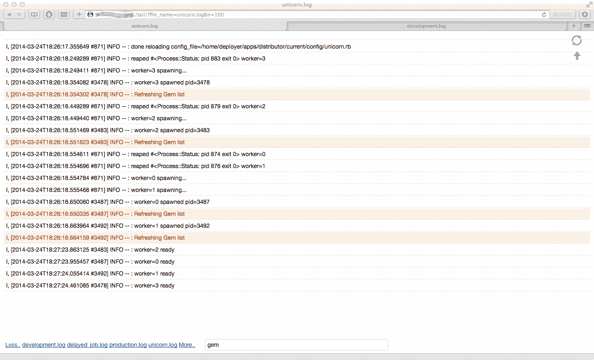

##Description

Tail command for your .log files via browser. In order to have a quick access to your .log files this gem provides *nix `tail` command functionality to your Rails application. If something goes wrong you don't have to ssh to your server anymore. Now you have normal scroll and search in browser instead of `nano`, `eamacs`, `vim`, `mcedit` - name it.

Also you can highlight any particular string you are looking for.

##Installation

Just include it into your Gemfile

    gem 'tail'

run `bundle install` and mount it at your `config/routes.rb` like this:

    mount Tail::Engine, at: "/tail"

After this, you will see all your .log files available at /tail path.

Of course, you can mount it `at: "/whatevername"` you like.

If you use Devise for authentication, gem will use it also.

##Requirements

Any *nix (including Mac OS) system.

Ruby 1.9.3+

Rails 3.2+

No other gems required. No jQuery or any JS frameworks required.

##License

This gem uses MIT-LICENSE. Fork it or create pull request. Any contribution is appreciated.
